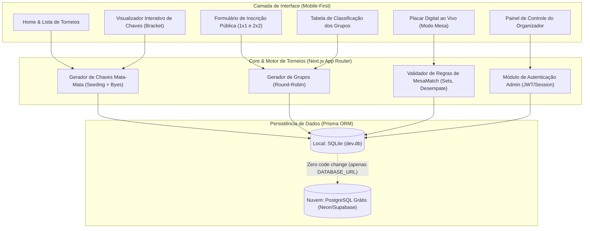

# Plano de Arquitetura e Implementação: Plataforma MesaMatch

## 🎯 Goal Description
Desenvolver uma plataforma web completa, responsiva e focada em dispositivos móveis para organização de campeonatos de **MesaMatch** em comunidades locais e projetos de extensão universitária. 

A plataforma foi pensada para operar com **zero atrito localmente** (basta rodar `npm run dev` com SQLite embutido, sem necessidade de Docker ou configurações em nuvem) e com **capacidade de deploy 100% gratuito** na nuvem (Vercel + Neon/Supabase PostgreSQL).

---

## 🏗️ Decisões Arquiteturais e Stack Técnica



### 1. Frontend & Backend Unificado: **Next.js 15 (App Router) + TypeScript**
- **Vantagem Local:** Roda com um único comando (`npm run dev`), servindo front e back simultaneamente no `localhost:3000`.
- **Vantagem Nuvem:** Deploy contínuo e gratuito em 1 clique na **Vercel**.

### 2. Camada de Dados: **Prisma ORM + SQLite (Local) / PostgreSQL (Nuvem)**
- **Ambiente Local:** Usa arquivo local `prisma/dev.db` (SQLite). Não precisa instalar banco de dados nem Docker.
- **Ambiente Nuvem (Gratuito):** O Prisma abstrai 100% do banco. Ao subir para produção, basta conectar uma URL do **Neon Serverless Postgres** ou **Supabase Free Tier** no `.env`.

### 3. Estilização & UI: **Tailwind CSS + Lucide Icons + Radix UI / shadcn/ui**
- Design esportivo autoral baseado na skill `frontend-design` / `impeccable`:
  - Visual enérgico, paleta esportiva vibrante (Verde grama/mesa, Grafite escuro, Laranja/Amarelo dinâmico).
  - Componentes de árvore de mata-mata com linhas conectadas e tabela de classificação de grupos fluida no mobile.
  - Modo "Mesa ao Vivo": interface de pontuação em tela cheia com botões grandes para quem estiver na beira da mesa marcando os pontos dos sets.

---

## 📋 Funcionalidades Principais do MVP

1. **Inscrições Públicas Descomplicadas**:
   - Formulário público compartilhável via link/WhatsApp.
   - Suporte a modalidades **Individual (1x1)** e **Duplas (2x2)** com nome do time/dupla e telefone de contato.
   - Status de inscrição: *Pendente*, *Confirmada*, *Lista de Espera*.

2. **Motor de Chaveamento Automático**:
   - **Mata-Mata (Eliminatória Simples)**: Geração de chaves para 4, 8, 16 ou 32 participantes, com tratamento automático de participantes ímpares (*BYE*).
   - **Fase de Grupos + Mata-Mata**: Divisão automática em grupos de 3 ou 4 duplas/atletas, cálculo de pontos por vitória, saldo de sets e saldo de pontos, avançando os 2 melhores de cada grupo para a fase final eliminatória.

3. **Placar e Regras de MesaMatch**:
   - Partidas em melhor de 1 set (18 ou 21 pontos) ou melhor de 3 sets.
   - Regra de diferença de 2 pontos (vantagem).
   - Atualização instantânea dos confrontos no chaveamento assim que uma partida é encerrada.

4. **Painel do Organizador**:
   - Criar e gerenciar múltiplos torneios/edições.
   - Sortear chaves com 1 clique (com opção de reembaralhar antes do início).
   - Lançar resultados diretamente ou atribuir placares.
   - Exportar tabela final e gerar resumo para relatório de extensão universitária.

---

## 🔍 User Review Required

> [!IMPORTANT]
> **Autonomia Local e Transição para Nuvem:**
> O projeto será configurado inicialmente para rodar 100% local com SQLite. Incluiremos um script simples de seed com torneios de exemplo para você testar imediatamente após a instalação.

> [!TIP]
> **Compatibilidade Móvel:**
> A prioridade do design é a visualização nos celulares dos participantes e organizadores à beira da mesa de jogo.

---

## 🗂️ Proposed Changes & Component Architecture

```
MesaMatch/
├── prisma/
│   ├── schema.prisma           # Modelos de Dados (Torneio, Participante, Grupo, Partida, Set)
│   └── seed.ts                 # Dados de exemplo para testes locais rápidos
├── src/
│   ├── app/
│   │   ├── layout.tsx          # Layout base responsivo com Navbar e Rodapé
│   │   ├── page.tsx            # Home com torneios ativos, passados e botão de criar
│   │   ├── torneios/
│   │   │   ├── novo/page.tsx   # Criação de torneio (formato, modalidade, regras)
│   │   │   └── [id]/
│   │   │       ├── page.tsx    # Visão geral do torneio, detalhes e link de inscrição
│   │   │       ├── inscricao/page.tsx # Formulário público de inscrição
│   │   │       ├── chaves/page.tsx    # Visualizador interativo de chaveamento mata-mata
│   │   │       ├── grupos/page.tsx    # Tabela de classificação dos grupos
│   │   │       ├── partidas/page.tsx  # Lista de jogos e resultados
│   │   │       └── mesa/page.tsx      # Modo Placar Digital ao Vivo para a mesa
│   │   ├── admin/
│   │   │   ├── login/page.tsx  # Login do organizador
│   │   │   └── painel/page.tsx # Gestão de inscrições, sorteio de chaves e controle
│   │   └── api/
│   │       ├── torneios/route.ts
│   │       ├── inscricoes/route.ts
│   │       ├── chaveamento/gerar/route.ts
│   │       └── partidas/[id]/resultado/route.ts
│   ├── components/
│   │   ├── ui/                 # Botões, Cards, Badges, Modais, Inputs
│   │   ├── tournament/
│   │   │   ├── BracketTree.tsx # Componente visual de árvore de mata-mata
│   │   │   ├── GroupTable.tsx  # Tabela com classificação, vitórias, saldo de sets
│   │   │   ├── MatchCard.tsx   # Card do confronto com placares parciais
│   │   │   └── Scoreboard.tsx  # Placar digital para mesa com botões touch grandes
│   │   └── layout/
│   │       └── Navbar.tsx
│   ├── lib/
│   │   ├── db.ts               # Instância do Prisma Client
│   │   ├── tournament-engine.ts# Lógica matemática de sorteio e chaveamento
│   │   └── auth.ts             # Funções de autenticação e sessão admin
│   └── types/
│       └── tournament.ts       # Tipagens TypeScript para torneios e partidas
├── package.json
├── tailwind.config.ts
├── tsconfig.json
└── README.md                   # Instruções de execução local e guia para deploy na nuvem
```

---

## 🧪 Verification Plan

### Automated Tests
- Testes unitários com Vitest/Jest para o **Tournament Engine**:
  - Geração de chave de 4, 8 e 16 participantes.
  - Tratamento de participantes ímpares com *byes*.
  - Cálculo de classificação de grupos (pontos, vitórias, saldo de sets, saldo de pontos).
  - Propagação de vencedores para as próximas fases do mata-mata.

### Manual Verification
- Iniciar o servidor local (`npm run dev`).
- Criar um torneio no formato Mata-Mata e outro no formato Grupos + Mata-Mata.
- Realizar inscrições públicas de teste via formulário.
- Sortear a chave no painel do organizador.
- Lançar resultados pelo modo Placar de Mesa e verificar avanço automático nas chaves.
- Testar a responsividade em telas mobile (simulador do navegador).
