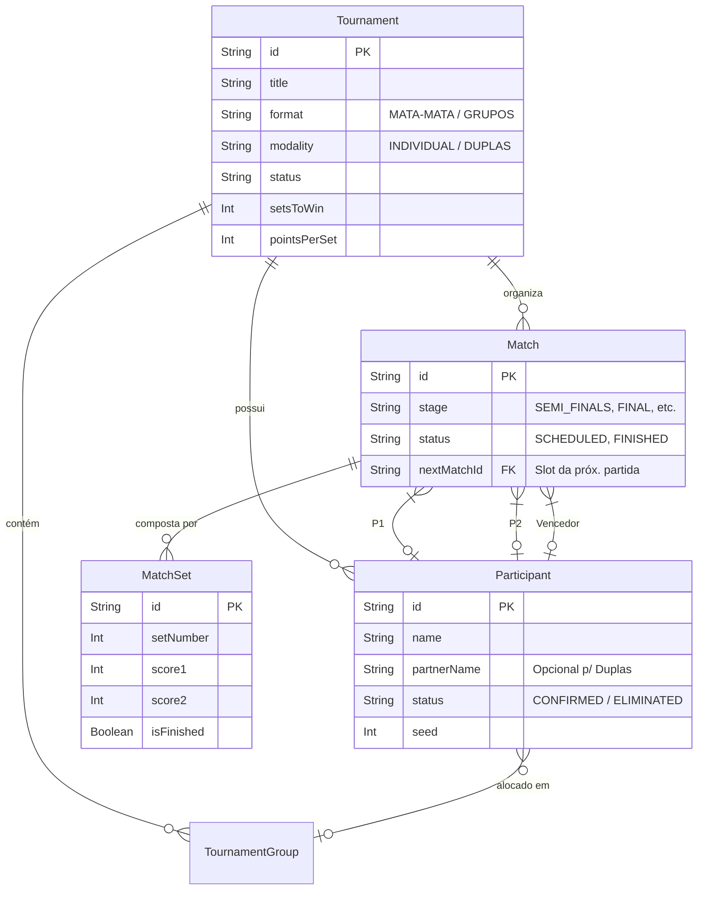

# MesaMatch 🏆

Plataforma livre e de código aberto criada para fomentar a integração, o esporte e o lazer em projetos de extensão universitária e torneios comunitários de MesaMatch.

## 🚀 Funcionalidades

- **Chaveamento Automático**: Geração automática de chaves (Mata-Mata) ou Fase de Grupos.
- **Inscrição Simplificada**: Link público fácil de compartilhar no WhatsApp para atletas se inscreverem com 1 clique.
- **Placar Digital ao Vivo**: Interface touch-friendly (mesa de arbitragem) para acompanhamento de pontos em tempo real, com cálculo automático de DEUCE (vantagem de 2 pontos).
- **Design System Esportivo**: Tema "Collegiate Forest & Vintage Gold", responsivo e otimizado para celulares.
- **Estatísticas Rápidas**: Tabelas de classificação de grupos com vitórias, derrotas, saldo de sets e de pontos.

## 🛠️ Tecnologias

- **Framework**: [Next.js 15](https://nextjs.org/) (App Router)
- **Linguagem**: [TypeScript](https://www.typescriptlang.org/)
- **Estilização**: [Tailwind CSS](https://tailwindcss.com/)
- **Banco de Dados**: [Prisma ORM](https://www.prisma.io/) (com SQLite localmente)
- **Testes**: [Vitest](https://vitest.dev/)

## 📋 Requisitos e Regras de Negócio

### Requisitos Funcionais
- **RF01:** O sistema deve permitir a criação de torneios definindo título, formato (Mata-Mata ou Grupos) e modalidade (Individual ou Duplas).
- **RF02:** O sistema deve fornecer um link público de inscrição para os atletas se cadastrarem.
- **RF03:** O sistema deve gerar o chaveamento automaticamente baseado no número de atletas confirmados e nas cabeças-de-chave (seeds).
- **RF04:** O sistema deve possuir uma mesa de arbitragem digital (Placar ao Vivo) para contagem de pontos e sets de cada partida.
- **RF05:** O sistema deve calcular automaticamente a vitória com base nas regras de "vantagem de 2 pontos" (Deuce).
- **RF06:** O sistema deve permitir a visualização pública do chaveamento em tempo real.

### Requisitos Não Funcionais
- **RNF01:** A interface deve ser *Mobile-First*, garantindo usabilidade total da mesa de arbitragem e inscrições via celular.
- **RNF02:** O sistema deve ser desenvolvido com o Next.js App Router (Renderização Server e Client).
- **RNF03:** O banco de dados deve utilizar SQLite (em ambiente local) ou PostgreSQL (em produção) com abstração via Prisma ORM.
- **RNF04:** O tempo de resposta para a atualização de placares ao vivo deve ser instantâneo na UI (*optimistic updates*).

### Regras de Negócio
- **RN01:** Um torneio não pode iniciar a geração de chaves caso não existam no mínimo 2 participantes.
- **RN02:** Em casos de empate no *match point* (ex: 20x20), vence quem abrir 2 pontos de vantagem, respeitando a configuração de `advantageRule` do torneio.
- **RN03:** Atletas que não confirmarem presença até o momento do sorteio devem ser ignorados no chaveamento ativo.
- **RN04:** Durante o chaveamento "Mata-Mata", o perdedor da semifinal deve automaticamente ser alocado para a disputa de "Terceiro Lugar".

## 🗄️ Banco de Dados e Arquitetura

### Modelo de Banco de Dados
A aplicação utiliza o Prisma ORM e modela o domínio em torno do conceito de um Torneio e suas entidades dependentes.

### Modelo Lógico e Conceitual (MER)

*No modelo acima, os Participantes competem entre si em Partidas (Matches), que são subdivididas em Sets (MatchSets). Todo o progresso histórico pertence a um Tournament (Torneio).*

## 📦 Como Rodar Localmente

1. Clone o repositório:
```bash
git clone https://github.com/VictorErbs/MesaMatch.git
cd MesaMatch
```

2. Instale as dependências:
```bash
npm install
```

3. Inicialize o banco de dados (SQLite local):
```bash
npx prisma generate
npx prisma db push
```

4. Popule o banco com dados de teste (opcional):
```bash
npx tsx prisma/seed.ts
```

5. Rode a aplicação:
```bash
npm run dev
```

Abra [http://localhost:3000](http://localhost:3000) no seu navegador.

## 🧪 Testes

Para rodar a suíte de testes:
```bash
npm test
```

## 🤝 Contribuição

Sinta-se à vontade para abrir *Issues* e enviar *Pull Requests*! Este é um projeto focado na comunidade e qualquer ajuda para melhorar a plataforma é super bem-vinda.
